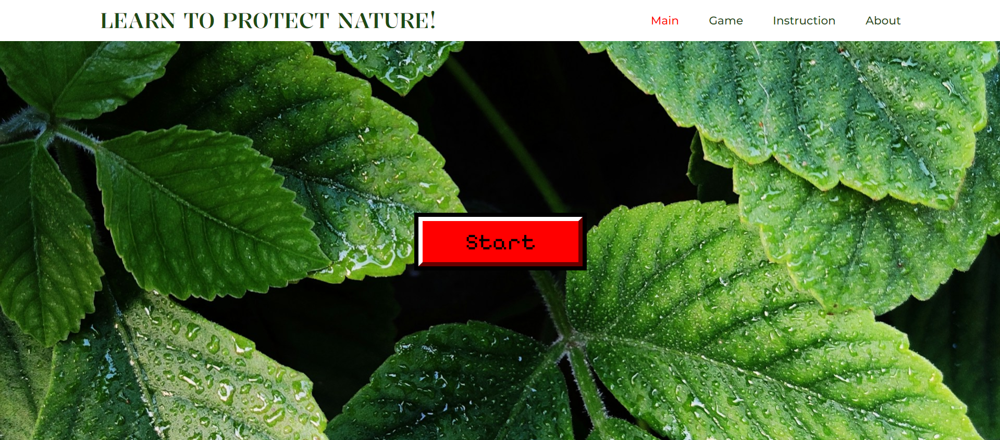
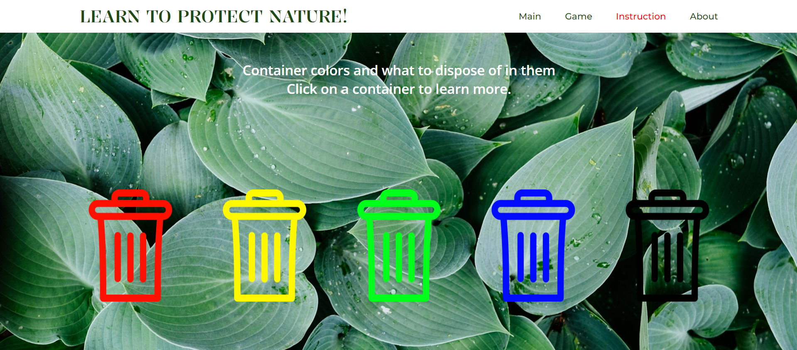
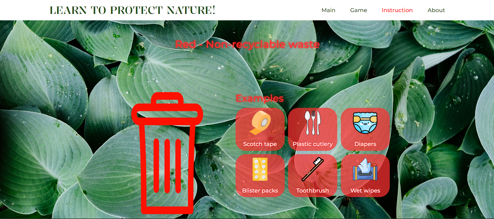
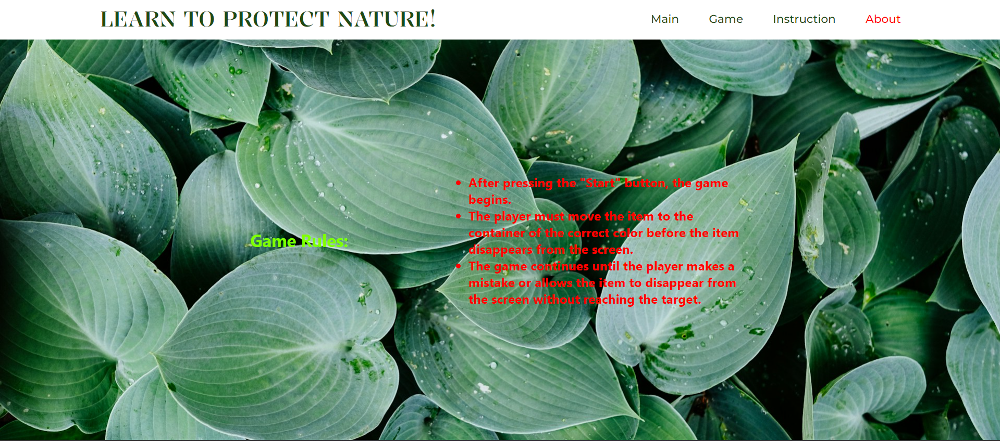
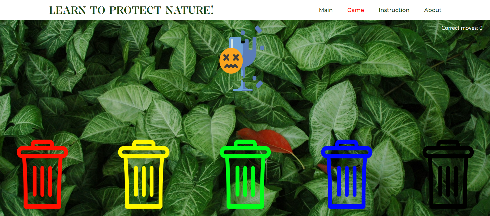
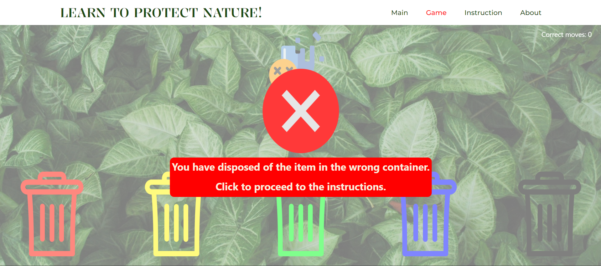
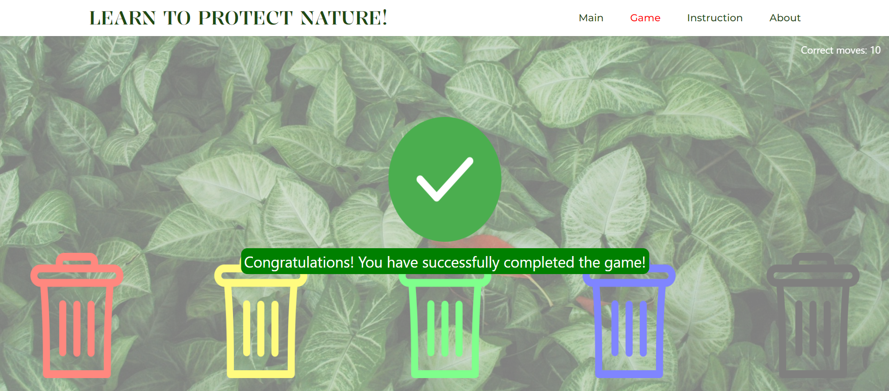

# Ecology App with React.js

This application was created to help all inhabitants of our planet Earth learn more about waste sorting. It's important because there has been a growing concern about waste on our planet recently. Therefore, this application will educate people on which products should be disposed of in which bins.

### Features
- **Game**: Our application features a game where users can move trash into the correct bins, helping them memorize where each item should be disposed of.
- **Uniqueness**: While exploring the vastness of the internet, we haven't encountered any similar pages with this functionality.

### Used Technologies
- **React.js**: This framework was used to develop all the functionality on our page.
- **React Drag and Drop**: This library was utilized to implement the drag and drop functionality for moving trash into the bins.

### How to Use
1. Upon entering the website, users are greeted with the homepage, which immediately offers them to start playing the game.

2. Users can proceed directly to the game or first visit the "Instructions" section to familiarize themselves with the types of trash.

3. After that, the user navigates to the "About the Game" section to read the game rules.

4. Once the user moves to the "Game" section, the game begins.

5. In case of an unsuccessful attempt, an error message will appear, and the system will suggest going back to the instructions.

6. In the case of a successful attempt, after completing 10 steps, a message will appear stating that all trash has been successfully moved into the bins.
